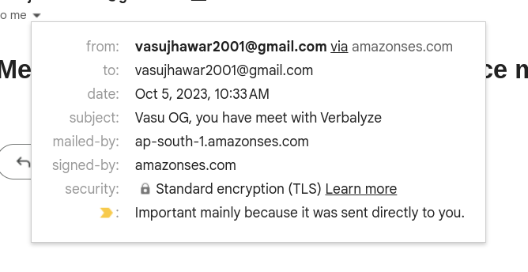

# Task Documentation

## Completed Tasks

1) MongoDB cluster and databse created.

2) AWS SES client registration and implementation completed. Tested, and able to send emails through ses client on nodejs. 

3) Google Calender API registered and credential created.

## Problems to Tackle

1) MongoDB Sticth has been DEPRECEATED. Cannot add any third-party services and cannot use it in trigger functions. Possible soultion to write your HTTP endpoint (trying to figure it out).

2) Google API authentication and authorisation to perform actions like creating and event and adding to calender (Google DOCS are worst)

## Need More Clearity to Problem Statement

1) What I have understood from the given problem is, we are given a database, and whenever there is new entry or any update(insert/update/delete operation on the database) we have to trigger an email notifictaion to relevant users.

2) Actually no proper image of database given, so difficult to follow up.  What and how events will be created, and when to particullary trigger the email notification.